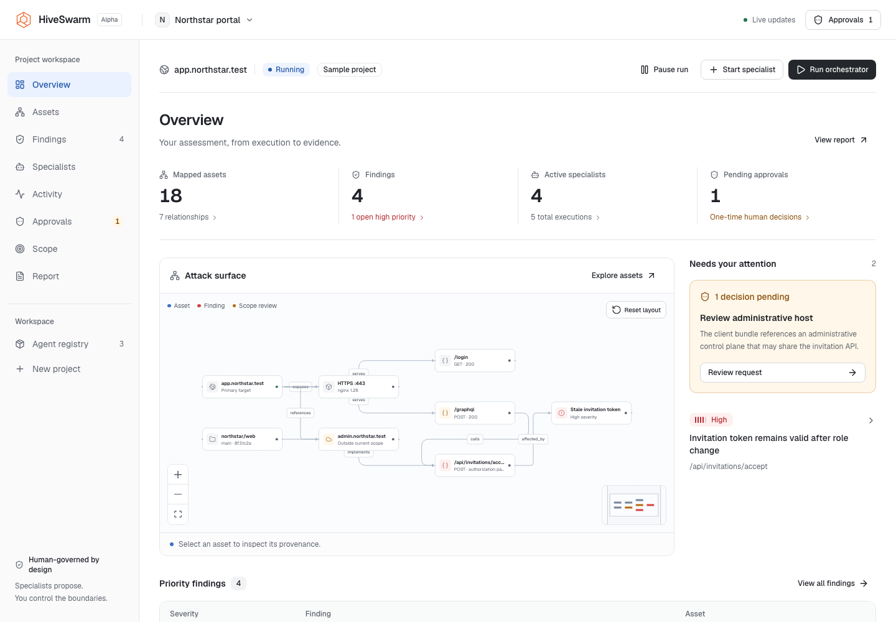
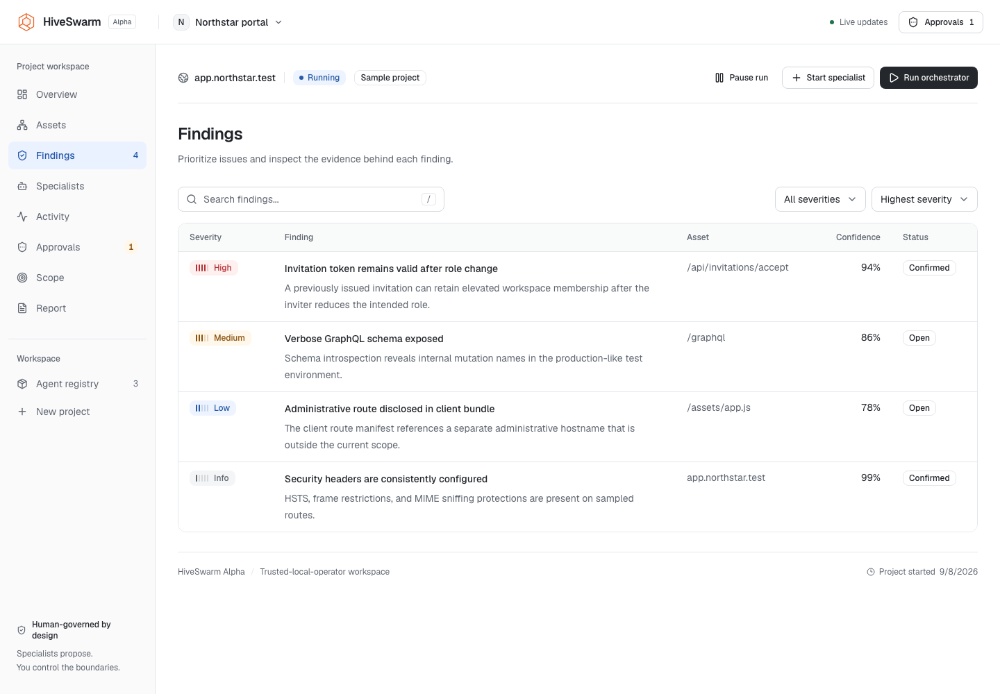
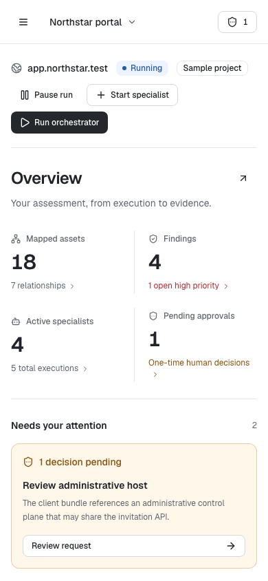

# Console redesign review

## Brief

Replace the UI comprehensively for expert operators, prioritize laptops, and retain complete access on narrow screens. The operator authorized changes to navigation and visual identity and named Vercel, Wiz, Apple, and recent Cloudflare sites as references. Human authority, explicit project ownership, recorded evidence, and safe simulated development remain constraints.

## Assessment

The old interface was spending too much width on persistent side panels and too little attention on the decisions an operator needed to make. A visual reskin would have left the most serious problems intact.

| Priority | Problem | Implemented response |
| --- | --- | --- |
| High | Mobile CSS hid the inspector and pause/resume control. | Responsive navigation and detail sheets; run actions wrap and remain present. |
| High | Run presentation collapsed waiting, completed, and other states into misleading labels. | Render the stored lifecycle state, lock duplicate submissions, and hide or disable state-inappropriate controls. |
| High | Only the first approval was exposed, and the action detail was separated from decision buttons. | Dedicated pending queue and history; complete action, rationale, context, and run ownership alongside decisions. |
| High | Scope proposals were described too much like one-time execution grants. | Explicit persistent-boundary warning and a distinct Approve scope change action. |
| High | A background mutation could pull the visible workspace back to its originating project. | Separate mutation ownership from navigation intent and guard late response parsing. |
| High | Reports could race or remain in a loading presentation after failure. | Project-scoped component state, stale-request guards, schema validation, explicit failure/retry, and rendered coverage. |
| Medium | Competing navigation levels duplicated Findings and obscured the distinction between evidence and controls. | One project navigation hierarchy with bookmarkable views and browser history. |
| Medium | Forms hid default capabilities and offered disabled packages. | Visible access selection, sensitive defaults off, enabled packages only, and shared request validation. |
| Medium | Project creation implied an exact URL boundary while creating a host rule. | Preview the real host/repository rule and explain that URL paths and ports do not narrow it. |
| Medium | Resizable navigation did not share stable alignment with the fixed header. | A shared fixed navigation width and content gutters; inspection no longer competes for permanent width. |
| Medium | Small uppercase and monospaced labels competed with readable prose. | Geist Sans for interface text, sentence-case labels, and monospace reserved for technical evidence. |

## Finish review

The finish review ran in-thread because the independent agent request hit a usage limit. No approved visual comp or independent reviewer verdict is claimed.

### Persistence

`apps/web/PRODUCT.md` records the confirmed operating context. `apps/web/DESIGN.md` records the implemented system. The application layout carries the user-pinned direction contract. The requested enterprise references, rather than a randomized visual concept, govern the design.

### Fidelity

| Element | Verdict | Evidence |
| --- | --- | --- |
| Laptop-first shell | Match | Compact navigation, shared content gutters, and on-demand inspection |
| Type | Match | Geist Sans hierarchy, restrained technical monospace, tabular figures |
| Material | Match | Flat white/graphite surfaces, single borders, no simulated glass or physical textures |
| Authority hierarchy | Match | Persistent approval count, dedicated queue, full request review |
| Mobile composition | Adaptation | Decisions precede the graph; navigation and inspection use accessible sheets |
| Evidence access | Match | Semantic lists/tables plus topology, swarm, scope, and finding-path graphs |

### Ceiling

This is a substantial operator-console redesign, not proof of an industry-leading product. That claim needs expert usability sessions, measured task-completion improvements, larger real-world evidence fixtures, and cross-browser testing. The implementation deliberately avoids decorative motion, simulated activity, and oversized branding that would compete with assessment work.

### Material fixes

Browser verification identified and corrected incomplete tab semantics in presentation controls, missing focus restoration, an overflowing minimap, duplicate table borders, a scope graph lacking a positioned container, and disconnected native-select chevrons. Geometric tests now verify filter alignment and graph containment. Keyboard-focusable table regions address narrow-screen horizontal scrolling.

The final regression suite passes. Remaining validation limits are manual screen-reader use, Safari and Firefox, high-volume graph responsiveness, and real operator task studies. No real scanners, Docker worker, provider key, or public target are part of this verification.

### Keep

Keep the distinction between an attractive display and a trustworthy assessment. Never hide authority changes, turn missing evidence into a success state, or trade readable working space for decorative activity.

## Verification result

Finish disposition: ship for local-alpha review, with the validation limits above.

| Check | Result |
| --- | --- |
| API, worker, and web typechecks | Passed |
| API tests | 26 passed |
| Web state and transport tests | 10 passed |
| Chromium browser tests | 20 passed across desktop and mobile |
| Automated WCAG A/AA checks | No violations in the nine tested views and tested dialogs |
| Viewport overflow | No document overflow at 1440px and 390px |
| Filter alignment and graph containment | Passed geometric assertions |
| Full API, worker, and web production build | Passed |
| Static design detector | No findings on the examined console/table/theme/graph files |
| Git whitespace checks | Passed |

## Screenshots

These are rendered browser captures of the built-in sample project using intercepted test data, not results from a live assessment. Before-state screenshots were not captured.

### Desktop overview



### Findings



### Mobile overview



## Reproduce

```sh
npm run typecheck
npm test
npm run test -w @hiveswarm/web
npm run test:e2e -w @hiveswarm/web
npm run build -w @hiveswarm/web
```

Browser requests are intercepted with isolated fixtures derived from the API's demonstration dashboard and report generator. The suite starts its own web server on `127.0.0.1:3300`, refuses to reuse an existing server, and stops only that server. Each desktop/mobile visual test writes per-view PNGs under `apps/web/test-results`. This is simulated UI verification, not an assessment result or a production security certification.
